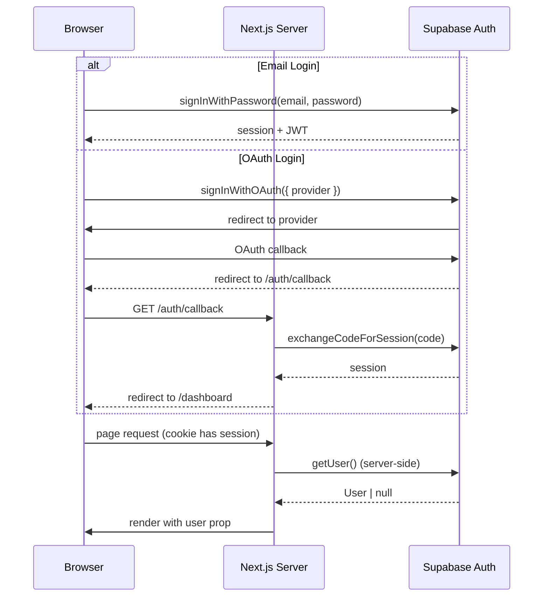
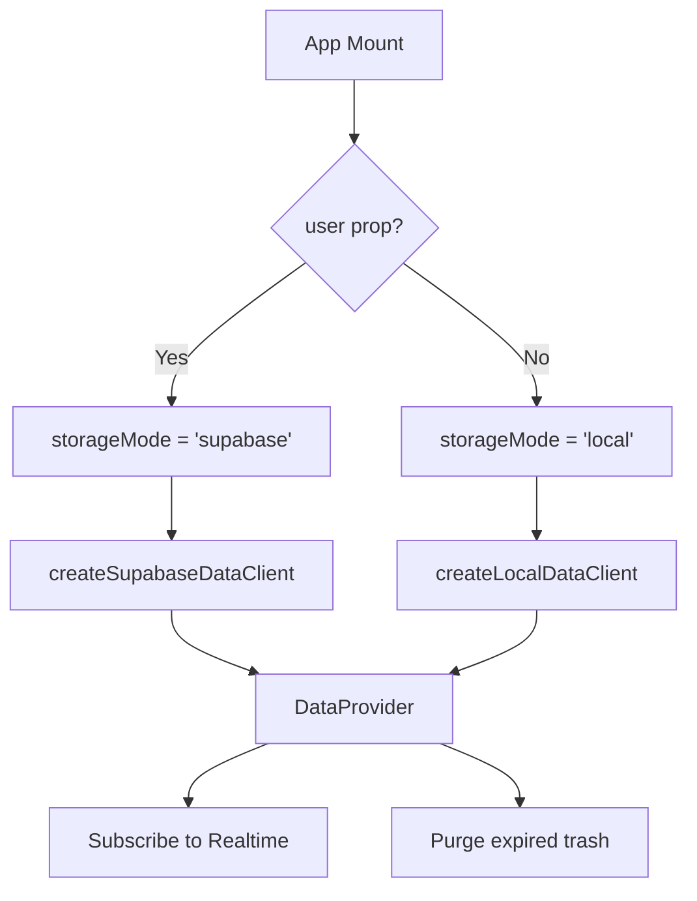
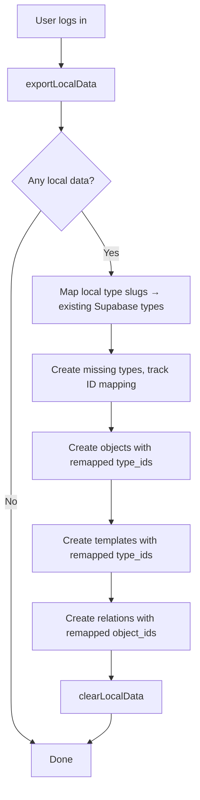

# Authentication & Authorization

**Sources:** `src/shared/lib/data/DataProvider.tsx`, `src/app/providers.tsx`, `src/app/api/account/delete/route.ts`

## Auth Methods

| Method | Provider |
|--------|----------|
| Email + Password | Supabase Auth |
| Google OAuth | Supabase Auth (Social Login) |
| GitHub OAuth | Supabase Auth (Social Login) |

## Auth Flow



## Storage Mode Selection



The `user` prop flows from the server component (`providers.tsx`) through `SpaceProvider` to `DataProvider`. A single `supabase.auth.getUser()` call happens server-side — no duplicate auth checks.

## Provider Hierarchy

```
Providers (providers.tsx)
  ├── QueryClientProvider
  │   └── ThemeProvider
  │       └── SpaceProvider (user, isAuthLoading)
  │           └── DataProvider (user, isAuthLoading, spaceId)
  │               └── App content
```

## Context Hooks

| Hook | Returns | Description |
|------|---------|-------------|
| `useAuth()` | `{ user, isLoading, isGuest }` | Auth state. `isGuest` is derived from `!user`. |
| `useStorageMode()` | `'supabase' \| 'local'` | Current storage backend |
| `useDataClient()` | `DataClient` | Active data client instance |
| `useSpaceId()` | `string \| null` | Current space ID |
| `useMigrateData()` | `() → Promise<void>` | Trigger local → Supabase migration |

## Guest → Authenticated Migration

When a guest user signs up/logs in, `useMigrateData()` exports all local data and imports it into Supabase:



Exported data shape: `{ objects, objectTypes, templates, objectRelations, spaces }`

## Account Deletion

**Endpoint:** POST `/api/account/delete`

1. Validate session (`supabase.auth.getUser()`)
2. Admin client deletes user (`auth.admin.deleteUser(userId)`)
3. Database ON DELETE CASCADE cleans up all user data

## New User Seeding

When a user signs up, a Supabase trigger (`handle_new_user_space`) automatically:
1. Creates a "My Space" space
2. Creates a "Page" type in that space

This happens server-side in PostgreSQL, not in the app.
