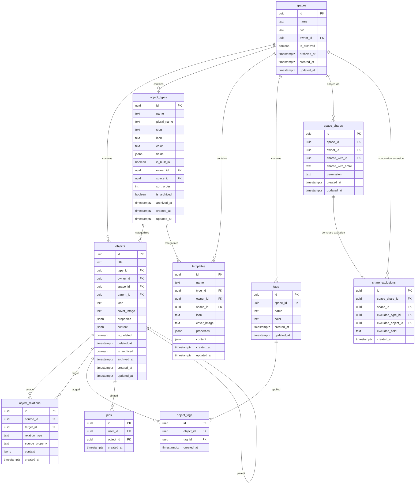

# Entity Relationship Diagram

All tables in the Swashbuckler database.

## ER Diagram

## Table Details

### Core Entities

| Table | Description | Space-Scoped |
|-------|-------------|:---:|
| spaces | Workspaces that contain all other data | — |
| objects | Entries (pages, notes, custom types) | Yes |
| object_types | Type definitions with custom fields | Yes (nullable for global) |
| templates | Reusable entry templates | Yes |

### Relationships

| Table | Description | Space-Scoped |
|-------|-------------|:---:|
| object_relations | Links between entries (mention, link) | Via objects |
| object_tags | Many-to-many join for tags on entries | Via objects |

### Metadata

| Table | Description | Space-Scoped |
|-------|-------------|:---:|
| tags | Labels for cross-type categorization | Yes |
| pins | Per-user pinned entries | Via objects |

### Sharing

| Table | Description | Space-Scoped |
|-------|-------------|:---:|
| space_shares | Permission grants (view/edit) | Yes |
| share_exclusions | Content hidden from shared users | Yes |

## Indexes

### objects
- `type_id` — filter by type
- `parent_id` — hierarchical queries
- `space_id` — space scoping
- `is_deleted` — trash queries
- `is_archived` — archive queries
- `updated_at` — sort by recency

### object_types
- `(space_id, slug)` — unique per-space slug (case-insensitive)
- `owner_id` — owner queries
- `sort_order` — display ordering

### object_relations
- `source_id` — outgoing relations
- `target_id` — incoming relations
- `(source_id, target_id, relation_type, source_property)` — upsert uniqueness

### tags
- `(space_id, name)` — unique per-space tag name (case-insensitive)

## Cascade Rules (PostgreSQL)

| Parent | Child | On Delete |
|--------|-------|-----------|
| object_types | objects | CASCADE |
| object_types | templates | CASCADE |
| objects | object_relations (source) | CASCADE |
| objects | object_relations (target) | CASCADE |
| objects | object_tags | CASCADE |
| objects | pins | CASCADE |
| tags | object_tags | CASCADE |
| spaces | objects | CASCADE |
| spaces | object_types | CASCADE |
| spaces | tags | CASCADE |
| space_shares | share_exclusions | CASCADE |
