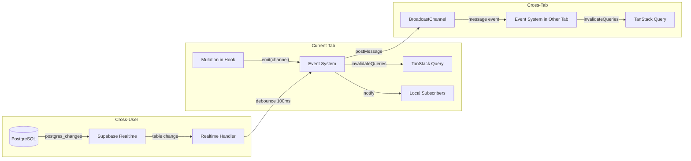
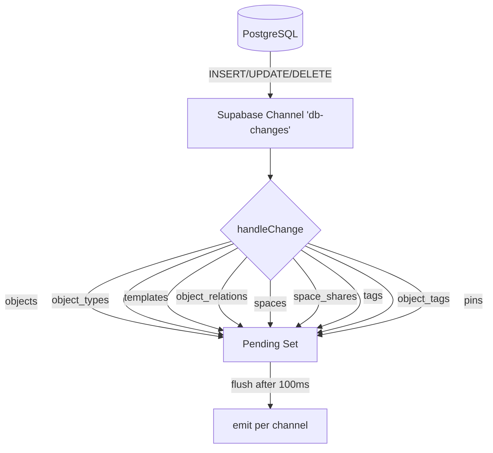
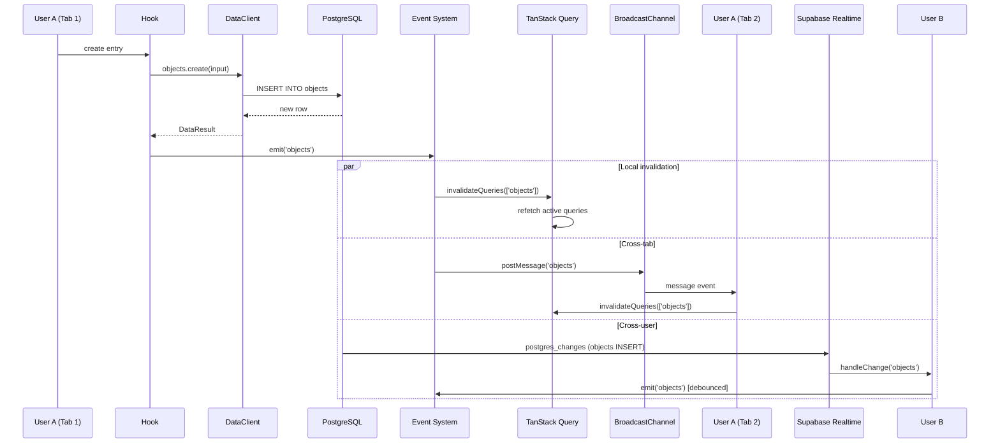

# Event System & Realtime Sync

The event system bridges mutations, cache invalidation, cross-tab sync, and Supabase Realtime into a unified pipeline.

**Sources:** `src/shared/lib/data/events.ts`, `src/shared/lib/data/realtime.ts`

## Architecture



## Event Channels

| Channel | Emitted By | Triggered Tables |
|---------|-----------|-----------------|
| `objects` | useObjects mutations | objects |
| `objectTypes` | useObjectTypes mutations | object_types |
| `globalObjectTypes` | global type mutations | object_types (space_id IS NULL) |
| `templates` | useTemplates mutations | templates |
| `objectRelations` | useObjectRelations mutations | object_relations |
| `spaces` | SpaceProvider mutations | spaces |
| `spaceShares` | useSpaceShares mutations | space_shares |
| `tags` | useTags mutations | tags, object_tags |
| `pins` | usePins mutations | pins |

## API

### emit(channel)

```typescript
function emit(channel: EventChannel): void
```

Called after every successful mutation. Does three things:
1. Notifies all local `subscribe()` listeners for that channel
2. Calls `queryClient.invalidateQueries()` with the channel's query prefix
3. Posts the channel name to `BroadcastChannel('swashbuckler-events')` for other tabs

### subscribe(channel, listener)

```typescript
function subscribe(channel: EventChannel, listener: () => void): () => void
```

Registers a callback for a channel. Returns an unsubscribe function. Used by SpaceProvider and useSpaceShares (which haven't been migrated to TanStack Query yet).

### setQueryClient(client)

```typescript
function setQueryClient(client: QueryClient): void
```

Called once during app init (`providers.tsx`) to register the QueryClient for invalidation.

## BroadcastChannel (Cross-Tab)

A single `BroadcastChannel('swashbuckler-events')` instance is created at module load. When `emit()` fires, the channel name is posted. Other tabs receive it and call `invalidateChannel()` which re-fetches stale queries.

This ensures that creating an entry in one tab immediately appears in another tab's sidebar.

## Supabase Realtime (Cross-User)

**Source:** `src/shared/lib/data/realtime.ts`

Subscribed when the user is authenticated. Watches postgres_changes on all data tables:



### Table → Channel Mapping

| Postgres Table | Event Channel |
|----------------|--------------|
| objects | objects |
| object_types | objectTypes |
| templates | templates |
| object_relations | objectRelations |
| spaces | spaces |
| space_shares | spaceShares |
| tags | tags |
| object_tags | tags |
| pins | pins |

Note: both `tags` and `object_tags` map to the `tags` channel.

### Debouncing

Realtime changes are debounced at 100ms. Multiple rapid changes (e.g., batch insert) accumulate in a `Set<EventChannel>` and flush together, preventing redundant invalidation cascades.

## Flow: End-to-End Mutation


