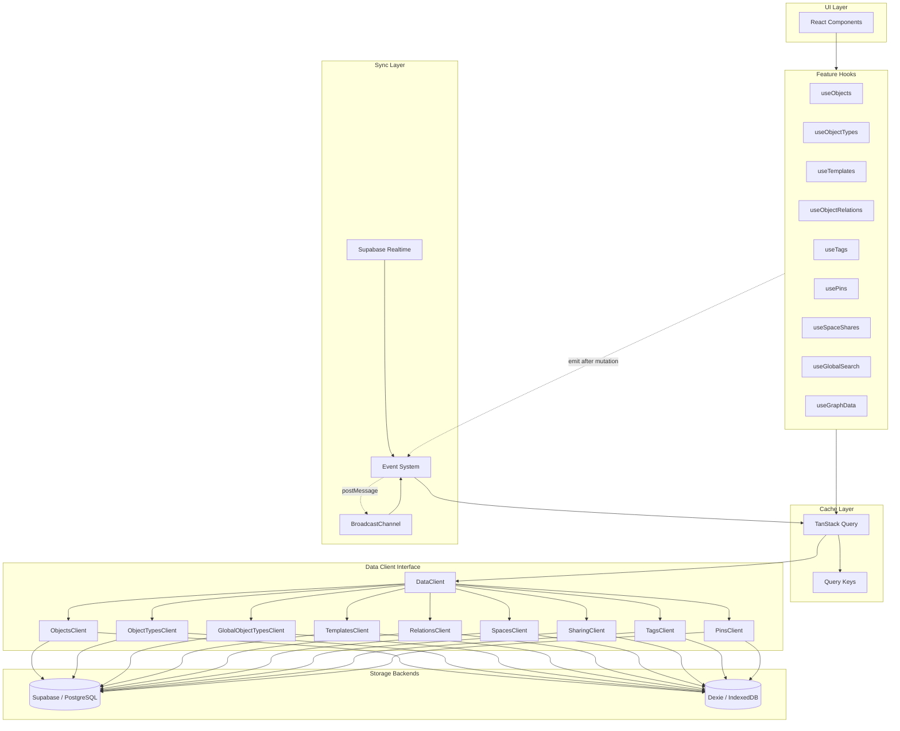
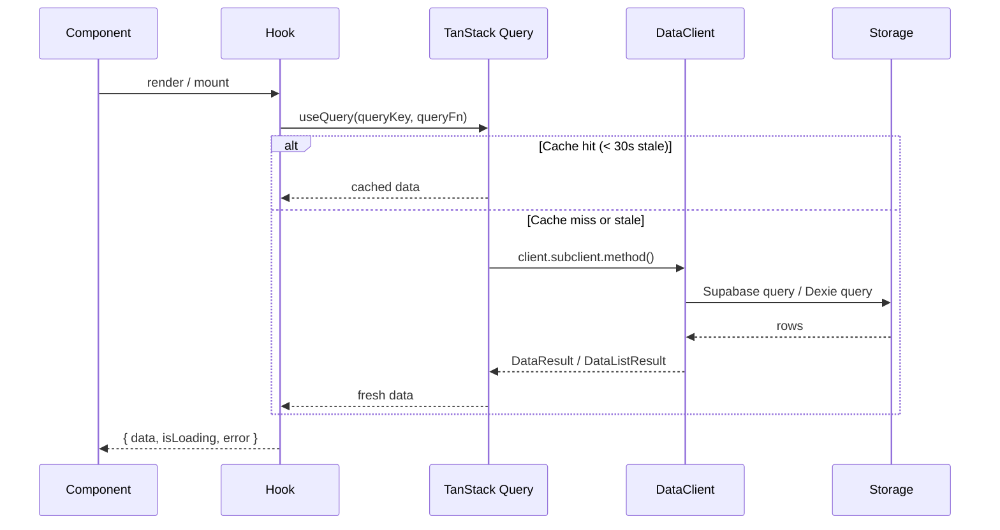
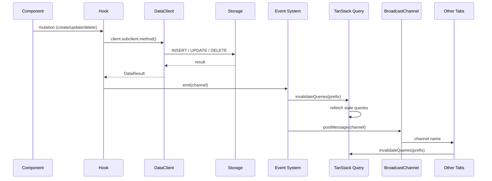

# API Documentation — Overview

Internal developer documentation for the Swashbuckler data layer.

## Tech Stack

| Layer | Technology |
|-------|-----------|
| Framework | Next.js 16 (App Router) |
| Block Editor | Slate.js + Plate |
| Database | Supabase (PostgreSQL) |
| Local Storage | Dexie (IndexedDB) |
| Auth | Supabase Auth (Email + OAuth) |
| Validation | Zod 4 |
| Caching | TanStack Query v5 |
| State | Zustand |
| Realtime | Supabase Realtime + BroadcastChannel |
| Collaboration | Yjs CRDT |

## Architecture

## Data Flow

### Read Path

### Write Path

## Cache Configuration

| Setting | Value |
|---------|-------|
| Stale time | 30 seconds |
| GC time | 5 minutes |
| Refetch on focus | Disabled |
| Retry | 1 attempt |

## Key Files

| File | Purpose |
|------|---------|
| `src/shared/lib/data/types.ts` | DataClient interface, all schemas, all sub-client interfaces |
| `src/shared/lib/data/supabase.ts` | Supabase implementation of DataClient |
| `src/shared/lib/data/local.ts` | Dexie (local) implementation of DataClient |
| `src/shared/lib/data/DataProvider.tsx` | React context, storage mode selection, migration |
| `src/shared/lib/data/SpaceProvider.tsx` | Space management, permission tracking |
| `src/shared/lib/data/queryKeys.ts` | TanStack Query key factory |
| `src/shared/lib/data/events.ts` | Event system, cross-tab BroadcastChannel |
| `src/shared/lib/data/realtime.ts` | Supabase Realtime subscription |

## Documentation Index

| Document | Contents |
|----------|----------|
| [Data Client](data-client.md) | DataClient interface, all 9 sub-clients, method signatures |
| [Hooks](hooks.md) | Feature-level data hooks, signatures, patterns |
| [Query Keys](query-keys.md) | TanStack Query key factory, invalidation strategy |
| [Events](events.md) | Event system, cross-tab sync, Supabase Realtime |
| [RPC Functions](rpc-functions.md) | Supabase SQL functions, triggers, migration index |
| [Auth](auth.md) | Authentication flow, session management, migration |
| [Permissions](permissions.md) | Space sharing, permission model, exclusions |
| [Storage](storage.md) | Supabase vs Dexie implementation comparison |
| [Entity Diagram](entity-diagram.md) | Entity relationship diagram, table schemas |
