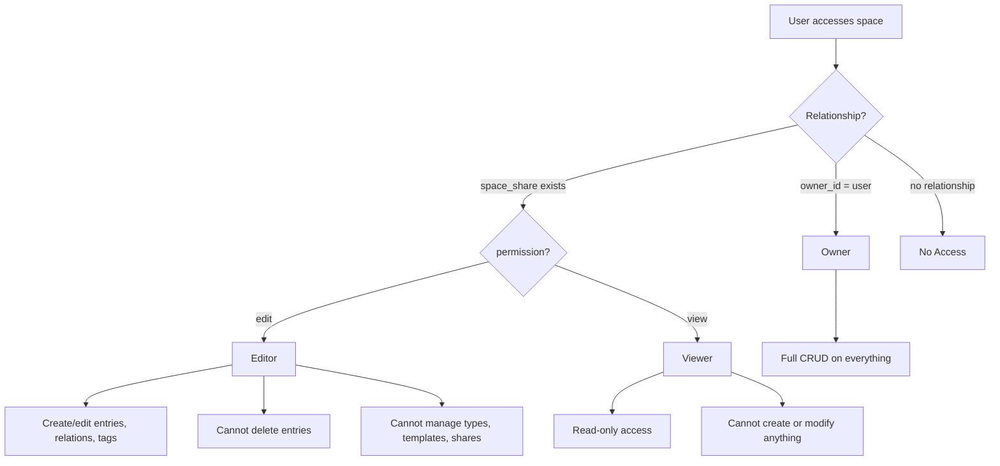
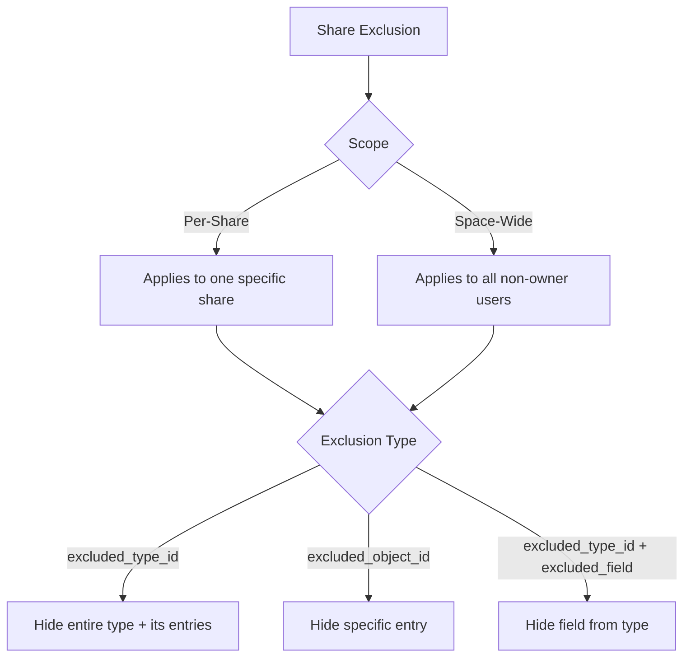
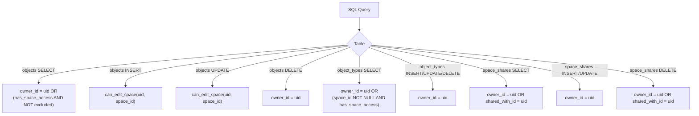

# Permission Model

Swashbuckler uses a space-based permission model with three levels and a flexible exclusion system.

## Permission Levels



| Level | Create Entries | Edit Entries | Delete Entries | Manage Types | Manage Shares |
|-------|:-:|:-:|:-:|:-:|:-:|
| Owner | Yes | Yes | Yes | Yes | Yes |
| Editor | Yes | Yes | No | No | No |
| Viewer | No | No | No | No | No |

## Space Permission Resolution

```typescript
type SpacePermission = 'owner' | 'edit' | 'view'
```

For the **current user** in the **current space**:
- `sharedPermission` from SpaceProvider is **always null** for space owners
- Use `useSpaceShares` to detect if an owner has active shares
- `canEdit` = owner OR edit permission

## Exclusion System

Owners can hide specific content from shared users using exclusions.



### Exclusion Types

| Input | Effect |
|-------|--------|
| `{ excluded_type_id }` | Type and all its entries hidden from shared user |
| `{ excluded_object_id }` | Single entry hidden from shared user |
| `{ excluded_type_id, excluded_field }` | Field hidden from type (entries still visible, but field value redacted) |

### Exclusion Scopes

| Scope | Stored As | Applies To |
|-------|-----------|------------|
| Per-share | `space_share_id` set, `space_id` null | Only the specific shared user |
| Space-wide | `space_id` set, `space_share_id` null | All non-owner users with space access |

### Enforcement

Exclusions are enforced at two layers:

1. **Database (RLS):** `is_object_excluded()` function checks exclusions in SELECT policies — excluded objects never leave PostgreSQL
2. **Frontend:** `useExclusionFilter()` hook filters client-side data (graph view, sidebar) for additional safety

## Private Content

Within entries, owners can mark individual blocks as private using the editor's Private Content block. These blocks:
- Are stored in the entry's content JSON
- Are filtered out client-side for non-owner users via `useExclusionFilter()`
- Appear as a locked placeholder to shared users

## RLS Policy Architecture



### Helper Functions (used in RLS)

| Function | Purpose |
|----------|---------|
| `user_has_space_access(user_id, space_id)` | Owner OR has space_share → boolean |
| `user_can_edit_space(user_id, space_id)` | Owner OR edit permission → boolean |
| `is_object_excluded(user_id, object_id)` | Checks per-share + space-wide exclusions → boolean |
