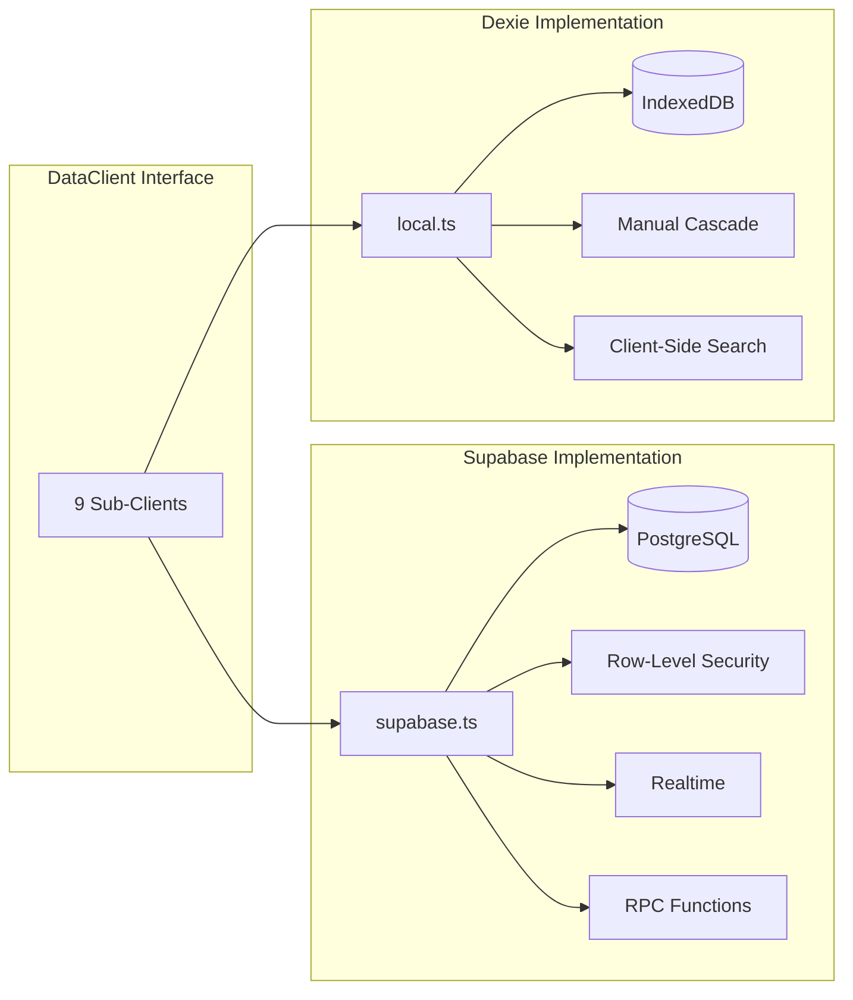

# Storage: Supabase vs Dexie

The DataClient interface has two implementations with identical APIs but different backends.

**Sources:** `src/shared/lib/data/supabase.ts`, `src/shared/lib/data/local.ts`

## When Each Is Used

| Condition | Storage Mode | Client |
|-----------|-------------|--------|
| Authenticated user | `supabase` | createSupabaseDataClient() |
| Guest / no user | `local` | createLocalDataClient() |

## Comparison



### Feature Comparison

| Feature | Supabase | Dexie |
|---------|----------|-------|
| Search | ILIKE + pg_trgm (title), client-side (content) | Client-side filter on both title and content |
| Cascade delete | ON DELETE CASCADE (FK) | Manual: delete related objects, relations, tags, pins |
| Unique slugs | Database constraint (case-insensitive) | Client-side filter + first() check |
| Sharing | Full (space_shares, exclusions) | Dummy no-op (always returns empty) |
| Realtime | Postgres changes subscription | N/A (single-user) |
| Auth | Supabase Auth (JWT, session cookie) | N/A (local only) |
| Error codes | `DUPLICATE` from unique constraints | `DUPLICATE` from manual check |

## Supabase Client

**Factory:** `createSupabaseDataClient(supabase, spaceId?, userId)`

- Uses `@supabase/supabase-js` client
- All queries scoped by `.eq('space_id', spaceId)` when spaceId is provided
- RLS policies enforce user-level access control
- `userId` used for `owner_id` on inserts

### Query Patterns

```typescript
// List with filters
supabase.from('objects')
  .select('id, title, type_id, ...')  // no content for summaries
  .eq('space_id', spaceId)
  .eq('is_deleted', false)
  .order('updated_at', { ascending: false })

// Create with space scoping
supabase.from('objects')
  .insert({ ...input, space_id: spaceId, owner_id: userId })
  .select()
  .single()

// Upsert for relations
supabase.from('object_relations')
  .upsert(input, { onConflict: 'source_id,target_id,relation_type,source_property' })
```

## Dexie Client

**Factory:** `createLocalDataClient(spaceId?)`

- Uses Dexie.js (IndexedDB wrapper)
- All queries scoped by `.where('space_id').equals(spaceId)` when provided
- `owner_id` set to `'local'` for guest mode

### Database: swashbuckler (Dexie v10)

**Stores and indexes:**

| Store | Indexes |
|-------|---------|
| objects | id, title, type_id, parent_id, is_deleted, is_archived, updated_at, space_id |
| objectTypes | id, name, slug, owner_id, sort_order, is_archived, space_id |
| templates | id, name, type_id, owner_id, updated_at, space_id |
| objectRelations | id, source_id, target_id, relation_type, created_at |
| spaces | id, name, owner_id, created_at, is_archived |
| tags | id, name, space_id |
| objectTags | id, object_id, tag_id |
| pins | id, object_id |

### Dexie Schema Versions

| Version | Changes |
|---------|---------|
| 1–5 | Core schema evolution |
| 6 | Added spaces table |
| 7 | Converted built-in types to space-scoped; removed Note type if unused |
| 8 | Added tags, objectTags tables |
| 9 | Added pins table |
| 10 | Added is_archived, archived_at columns |

### Local Default IDs

| Entity | ID |
|--------|-----|
| Default Space ("My Space") | `00000000-0000-0000-0000-000000000099` |
| Default Page Type | `00000000-0000-0000-0000-000000000101` |
| Legacy Page (v2 compat) | `00000000-0000-0000-0000-000000000001` |
| Legacy Note (v2 compat) | `00000000-0000-0000-0000-000000000002` |

### Cascade Delete (Manual)

When deleting a type in Dexie, the client manually:
1. Deletes all objects of that type
2. Deletes all object_relations where source or target is an object of that type
3. Deletes all templates of that type
4. Deletes all object_tags for objects of that type
5. Deletes all pins for objects of that type

This mirrors the ON DELETE CASCADE behavior in PostgreSQL but requires explicit implementation.
